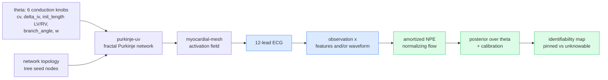
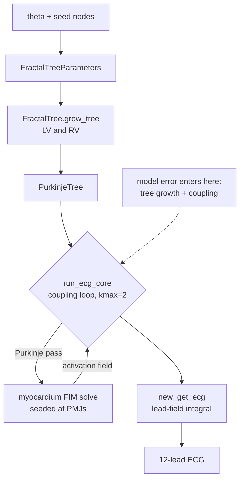
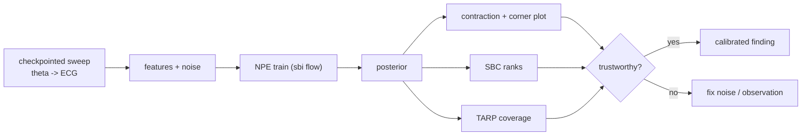
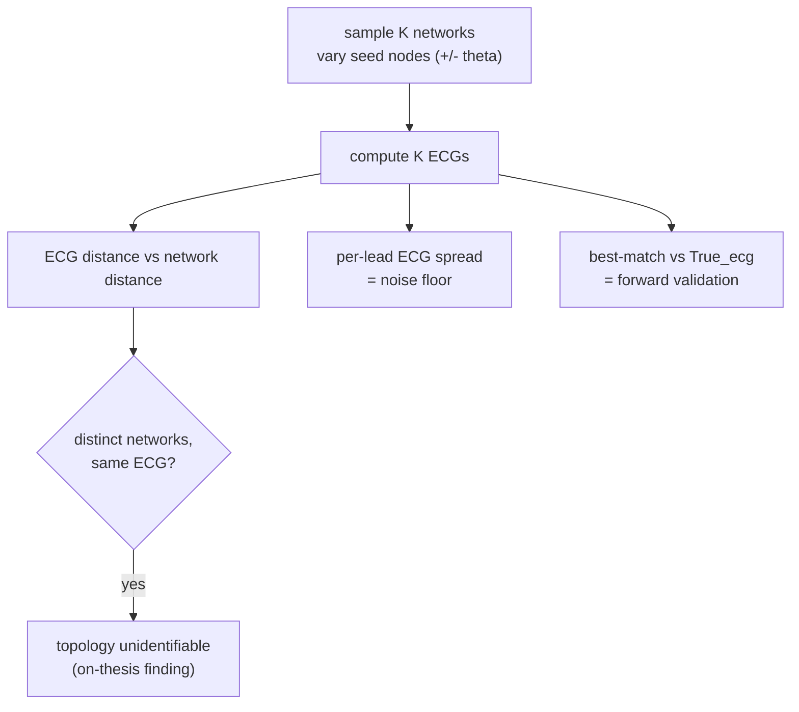
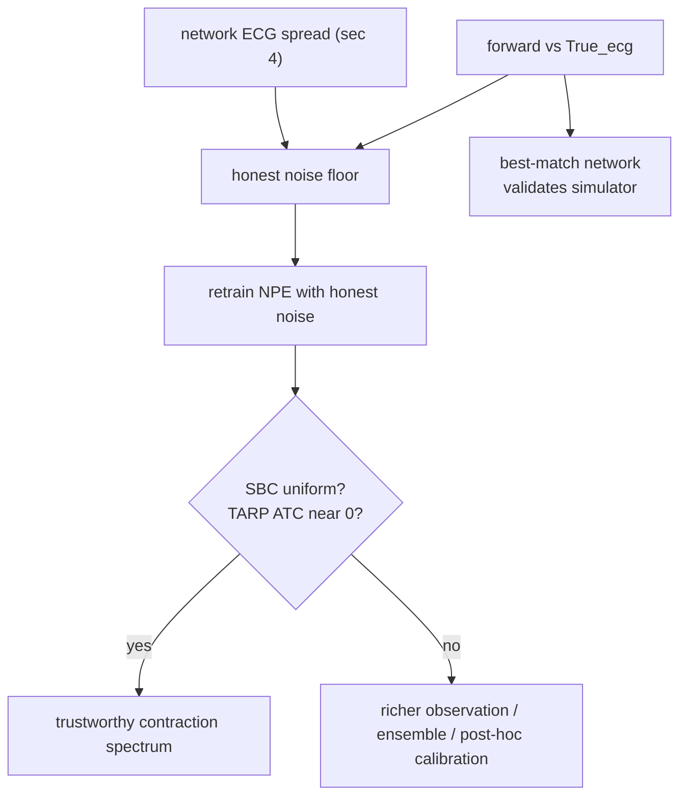
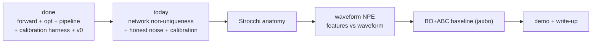

# PLAN, ecg-purkinje-npe

How the project works, end to end, and where it is going. Each section says **what** we do, **how** we do it, **why**, and the **next** direction, paired with a diagram. Companion to `docs/research-brief-v5.md` (the source of truth) and `docs/status-day1.md` (the running status log).

---

## 1. The scientific question

**What.** Given only a surface ECG, how much of the heart's fast-wiring (the His-Purkinje conduction system) can you actually recover, and how much is fundamentally unknowable? We answer this at fixed anatomy by training an amortized Neural Posterior Estimator (NPE) and reporting a per-parameter **identifiability spectrum** with honest, calibrated uncertainty.

**How.** A simulator turns conduction parameters and a Purkinje network into a 12-lead ECG. We run it thousands of times, train an AI to invert it (ECG in, a probability distribution over parameters out), and grade that AI's confidence with formal calibration tests.

**Why.** Personalizing the conduction system underpins cardiac digital twins (CRT, diagnosis, in-silico trials). The honest object is not a single fit but a posterior: possibly multimodal or degenerate. Naming which parameters are pinned and which are unknowable, with calibration you can trust, is the contribution.

**Next.** Move from the toy `crtdemo` geometry to the public Strocchi anatomy, add the waveform path, and validate against a non-amortized baseline.

---

## 2. The forward model (simulator)

**What.** A deterministic map from parameters to a 12-lead ECG on a fixed heart.

**How.** `purkinje-uv` grows LV and RV fractal Purkinje trees from `FractalTreeParameters` (conduction `theta` plus the seed nodes that root the tree on the endocardium). `myocardial-mesh` then runs the Purkinje-to-myocardium coupling loop (`run_ecg_core`): alternating a Purkinje activation pass and a volumetric myocardial eikonal (FIM) solve seeded at the Purkinje-muscle junctions, then a lead-field integral (`new_get_ecg`) that produces the 12 leads. It is deterministic given all inputs (confirmed Day 1: same inputs give a bit-identical ECG).

**Why.** Because it is deterministic, an explicit observation-noise model is mandatory, without it calibration is meaningless (artificially perfect). Determinism also means "different networks" come from discrete structural choices (mainly the seed nodes), not random draws.

**Next.** The coupling converges in 2 iterations on `crtdemo`, so we cap `kmax=2` and skip the per-iteration ECG recompute, a bit-identical 1.87x speedup (14.2s to 7.6s per run).

---

## 3. Inference and calibration

**What.** Train the NPE and, crucially, check whether its stated confidence is honest.

**How.** A parallel, checkpointed sweep (`run_sweep_checkpointed`) draws `theta` from the prior, runs the forward, adds observation noise, and extracts engineered features. `sbi` trains a normalizing-flow NPE on the pairs. We then report, per parameter, the **contraction** (posterior std / prior std, how much the ECG narrows a knob) and a **degeneracy corner plot**, and we grade calibration with **SBC** (are the credible intervals the right size?) and **TARP expected coverage**.

**Why.** Contraction alone is a trap: an overconfident estimator contracts too and looks great while being wrong. SBC and TARP are what make a contraction number trustworthy or expose it as an artifact.

**Next.** v0 shows exactly that trap (see section 5): tight-looking posteriors that fail calibration. The fix is the noise model, not more data.

---

## 4. Purkinje network non-uniqueness

**What.** Test the field's core problem directly: can very different Purkinje networks produce near-identical ECGs?

**How.** The tree is deterministic given its inputs, so we generate genuinely different networks by varying the **seed nodes** (where the tree roots on the endocardium), and optionally `theta`. We compute each network's ECG, then compare ECG distance against network distance, and measure each network's error versus the real ground-truth ECG (`nb/True_ecg`).

**Why.** Three payoffs from one experiment: (1) if distinct networks give near-identical ECGs, topology is unidentifiable (the on-thesis result, cf. Grandits 2024); (2) the ECG spread across plausible networks is the honest observation-noise floor; (3) the network closest to the true ECG validates the simulator.

**Next.** Feed the measured spread into the noise model (section 5), and decide with the director whether network topology becomes a nuisance latent the NPE marginalizes over.

---

## 5. Where we are, and the unified fix

**What.** The full pipeline runs; the science is at an honest v0. The 1250-sim snapshot gives a plausible contraction spectrum (delta_iv most identifiable at 0.20, branch_angle least at 0.81) **but the posteriors are overconfident and miscalibrated** (SBC fails on all six parameters, TARP ATC -0.096, the true theta sits in the tails of the corner plot). The budget curve is flat, so this is **not** a data-starvation problem.

**How (the fix).** The likely cause is that our observation noise (5% per-lead) is smaller than the real forward-model discrepancy. We measure that discrepancy two ways, the ECG spread across plausible Purkinje networks (section 4) and our forward versus the true ECG, then set the noise model to that honest level and re-check SBC and TARP.

**Why.** Too-small noise makes the NPE learn a near-deterministic map and produce sharp, overconfident posteriors that miss under any model mismatch. An honest noise floor widens the posteriors to match reality, which is what calibration demands. This unifies both goals: reducing forward error and sizing the noise are the same measurement.

**Next.** If honest noise fixes calibration, re-sweep once storing waveforms (so we iterate noise and features and train the waveform NPE without re-simulating), then infer the real `True_ecg` to escape the inverse crime.

---

## 6. Roadmap

**What.** From a calibrated toy result to a public-anatomy, baseline-validated finding with a demo.

**Next.** Strocchi mesh ingestion (real anatomy), the waveform + CNN-embedding NPE and the paired features-vs-waveform comparison, a BO+ABC baseline (`jaxbo`) on shared held-out ECGs (agreement plus an amortization-artifact control), then the demo (3D activation map, ECG overlay, corner plot, calibration panel).

