# ecg-purkinje-npe

**Calibrated, amortized identifiability of the Purkinje conduction system from the surface ECG.**

[](https://github.com/ricardogr07/ecg-purkinje-npe/actions/workflows/ci.yml)
[](LICENSE)

We train an amortized Neural Posterior Estimator (`sbi`) over cardiac conduction parameters at fixed
anatomy and report, with formal calibration, **which parts of the His-Purkinje conduction system a
12-lead ECG can and cannot recover, at a stated observation-noise floor**. The contribution is a
scientific finding, not a new method. Everything is measured on a **simulated** ECG; there is no real
ECG in this project, and comparison against measured recordings is future work.

Live demo: https://d2b1qd2pllzgje.cloudfront.net



_Conduction parameters through the simulator and an amortized NPE to a calibrated identifiability
map. Full walkthrough in [`docs/architecture.md`](docs/architecture.md)._

## The finding

At the operating noise floor (white Gaussian, sigma = 0.025 mV per sample per lead, on a
physiological-mV forward), the interventricular delay (`delta_iv`) and myocardial conduction velocity
(`cv_myo`) are tightly constrained, while the branch-angle and diffuse-block tree-shape parameters are
formally unidentified. Identifiability is a property of the forward map relative to a stated noise
floor, measured on a calibrated posterior, not a property of a parameter in isolation.

Along the way we surfaced and corrected three of our own errors: simulation-based calibration caught
an overconfident posterior, a ridge-confirmation experiment refuted a claimed degeneracy, and an audit
found a 3000x signal-to-noise error. That self-correction record, backed by a public verification
ledger, is the methodological contribution.

- [`docs/results-summary.md`](docs/results-summary.md), the headline result and the corrections.
- [`docs/architecture.md`](docs/architecture.md), how the pipeline works end to end.
- [`docs/research-brief.md`](docs/research-brief.md), the scientific source of truth: problem, method,
  prior art, priors and noise-model provenance.
- [`docs/verification-ledger.md`](docs/verification-ledger.md), every load-bearing claim, checked
  against a primary source or flagged as asserted.
- [`technical-writeup/manuscript.md`](technical-writeup/manuscript.md), the full write-up.

## Reproduce

Weights, sweeps, and calibration artifacts ship in the
[`v0.1.0-submission` release](https://github.com/ricardogr07/ecg-purkinje-npe/releases/tag/v0.1.0-submission);
the trained posterior regenerates the shipped results bit-for-bit. See
[`REPRODUCE.md`](REPRODUCE.md) for the full recipe (environment, checkpoint regeneration, and building
the container images from source).

```
uv sync
uv run pytest
uv run conduction-lens --help          # the pipeline CLI (sweep -> NPE + conformal -> artifact)
```

## Stack

Python via `uv` (`ruff`, `pytest`), `sbi` for the neural posterior estimator. FastAPI + Next.js for the
demo, deployed as a static export to AWS S3 + CloudFront (CPU-only, no GPU anywhere). Data: the Strocchi
four-chamber mesh cohort (Zenodo 3890034, CC-BY-4.0).

## Attribution and vendored components

This project stands on the author's own open-source libraries, vendored in-tree under `packages/` and
reworked during the work as part of the analysis:

- `packages/purkinje-uv` (MIT), fractal-tree Purkinje generation and the FIM eikonal activation solver;
  its mesh-ingestion layer is reworked here. Upstream: https://github.com/ricardogr07/purkinje-uv
- `packages/myocardial-mesh` (MIT), the volumetric myocardial eikonal and the pseudo-ECG synthesis (a
  `1/|r|` infinite-homogeneous-medium kernel at assumed standard electrode positions, not a torso
  volume conductor) producing the 12-lead ECG, plus the bundled crtdemo geometry.
  Upstream: https://github.com/ricardogr07/purkinje-learning-myocardial-mesh
- `packages/jax-bo` (Apache-2.0, author's own fork), the Bayesian-optimization validation baseline.

Each vendored library retains its upstream LICENSE. `myocardial-mesh` (repo
`purkinje-learning-myocardial-mesh`) is a separate published MIT library for the forward simulator,
distinct from the thesis-analysis package `purkinje-learning`, which is deliberately not used.

## Acknowledgements

This work is heavily inspired by, and builds directly on, Francisco Sahli Costabal's line of research
on learning the His-Purkinje system from the ECG, in particular "Probabilistic learning of the Purkinje
network from the ECG" (Alvarez-Barrientos, Salinas-Camus, Pezzuto, Sahli Costabal, Medical Image
Analysis 2025, [arXiv:2312.09887](https://arxiv.org/abs/2312.09887)). That paper is the direct point of
departure for this follow-on characterization; our contribution is to make the same target problem
amortized and formally calibrated.

The vendored `purkinje-uv` and `myocardial-mesh` libraries were developed and reworked by the author
around this problem during their MSc, and the fractal-tree Purkinje generation they implement is the
Sahli Costabal, Hurtado, Kuhl 2015 method ("Generating Purkinje networks in the human heart",
J. Biomech., PMID 26748729). See [`docs/related-work.md`](docs/related-work.md) for the full prior-art
positioning.

## License

Apache-2.0.
