# Architecture

How the project works, end to end, and where it is going. Each section says **what** we do, **how**, **why**, and the **next** direction, with a diagram. Companion to `docs/research-brief.md` (scientific source of truth), `docs/contracts.md` (frozen interfaces), and `docs/results-summary.md` (the headline finding).

## Thesis
We built a calibrated, amortized identifiability characterization of the Purkinje conduction system from a simulated 12-lead ECG, at a stated observation-noise floor.

No real ECG has been yet run for this work. The forward is a pseudo-ECG in an unbounded homogeneous volume conductor, amplitudes are reported in arbitrary units scaled to a stated mV operating point, and every target is simulator output. Comparison against measured ECGs is future work.

---

## 1. The scientific question

**What.** Given only a surface ECG, how much of the heart's fast-wiring (the His-Purkinje conduction system) can you actually recover, and how much stays unresolved at a stated noise floor? We answer this at fixed anatomy by training an amortized Neural Posterior Estimator (NPE) and reporting a per-parameter identifiability spectrum with honest, calibrated uncertainty.

**How.** A simulator turns conduction parameters and a Purkinje network into a 12-lead ECG. We run it thousands of times, train an AI to invert it (ECG in, a distribution over parameters out), and grade that AI's confidence with formal calibration tests (SBC, TARP).

**Why.** Personalizing the conduction system underpins cardiac digital twins (CRT, diagnosis, in-silico trials). The honest object is not a single fit but a posterior, possibly multimodal or degenerate. Naming which parameters are well constrained and which are diffuse, with calibration you can trust, is the contribution.

**Next.** Move from the `crtdemo` geometry to the public Strocchi anatomy, add the waveform path, and validate against a non-amortized baseline.

<!-- source: images/mermaid/architecture-01.mmd -->

---

## 2. The forward model

**What.** A deterministic map from parameters to a 12-lead ECG on a fixed heart.

**How.** `purkinje-uv` grows LV and RV fractal Purkinje trees from `FractalTreeParameters`. `myocardial-mesh` then runs the Purkinje-to-myocardium coupling loop (`run_ecg_core`): a Purkinje activation pass, a volumetric myocardial eikonal (FIM) solve seeded at the Purkinje-muscle junctions, then a lead-field integral (`new_get_ecg`, synthesized with a `1/|r|` infinite-homogeneous-medium kernel at assumed standard electrode positions; no torso volume conductor) that produces the 12 leads. Deterministic given all inputs (confirmed: same inputs give a bit-identical ECG).

**Why.** Because it is deterministic, an explicit observation-noise model is mandatory, otherwise calibration is artificially perfect. Determinism also means different networks come from discrete structural choices (mainly the seed nodes), not random draws.

**Next.** The coupling converges in 2 iterations on `crtdemo`, so we cap `kmax=2`, a bit-identical 1.87x speedup (14.2s to 7.6s per run).

<!-- source: images/mermaid/architecture-02.mmd -->

---

## 3. Inference and calibration

**What.** Train the NPE and, crucially, check whether its stated confidence is honest.

**How.** A parallel, checkpointed sweep draws theta from the frozen prior (Contract A, 7 params), runs the forward, adds the mandatory absolute-mV observation noise (Contract D: 0.05 mV amplitude, 5 ms timing, 0.025 mV waveform floor), and extracts features. `sbi` trains a normalizing-flow NPE. We report per-parameter contraction (posterior std / prior std) and a degeneracy corner plot, and grade calibration with SBC and TARP. Where the flow is overconfident, a per-parameter conformal recalibrator restores coverage with a guarantee.

**Why.** Contraction alone is a trap: an overconfident estimator contracts too and looks great while being wrong. SBC and TARP are what make a contraction number trustworthy or expose it as an artifact. The v0 miscalibration turned out to be inference-side (the density estimator, roughly 1.3x too narrow), not the noise floor, so the principled fix is conformal recalibration, not more data.

**Next.** Re-sweep storing waveforms so we can iterate the observation and train the waveform NPE without re-simulating, then a BO+ABC baseline as an independent check.

<!-- source: images/mermaid/architecture-03.mmd -->

---

## 4. The two honest results

**Result A, synthetic-truth identifiability.** On the simulator, with the frozen contract and noise model, a calibrated per-parameter contraction spectrum and a posterior degeneracy map. Independent corroboration: a third-party Sobol analysis (Tanikella 2025) predicts `branch_angle` and `w` are weakly identifiable and interaction-heavy, which is exactly the diffuse-block degeneracy we expect. This result is calibration-honest and synthetic-truth, not real-ECG-validated.

**Result B, parameter recovery against a synthetic target (not a real-ECG comparison).** There is no real ECG here. `True_ecg` is a pickled simulator output stored beside the true Purkinje trees and used as a regression fixture (`myocardial-mesh/tests/e2e/test_nb_parity.py`), not a patient recording. So the transplant result (true activation reproduces `True_ecg` at corr 1.000) is a self-consistency check, not evidence of fidelity: the same operator on the same activation field on the same mesh necessarily returns the same ECG. Result B compares our forward at the inferred theta against our forward at the stored true theta. Correcting the operating point lifts per-lead correlation from 0.199 to 0.788, and the remaining residual is parameter error. This is a parameter-recovery sanity check in the inverse-crime setting, not a fidelity result. A real forward-vs-measured-ECG comparison is future work.

<!-- source: images/mermaid/architecture-04.mmd -->

---

## 5. Where we are

The full pipeline runs. Contract A is frozen at 7 parameters and Contract D (absolute-mV noise) is set. The calibration bottleneck is diagnosed as inference-side and addressed by a per-parameter conformal recalibrator (self-check passes on synthetic data). Result B's parameter recovery in the inverse-crime setting reaches corr 0.788 at the corrected operating point, with the residual attributable to parameter error. The identifiability result stays framed as a synthetic-truth SBC study.

---

## 6. Roadmap

**What.** From a calibrated synthetic-truth result to a public-anatomy, baseline-validated finding with a demo, plus the fidelity residual closed as far as time allows.

**Next.** Expose `cv_myo` for the 7D sweep (also helps the fidelity residual); re-anchor the reference to the corrected operating point; Strocchi anatomy ingestion; the waveform + CNN-embedding NPE and the paired features-vs-waveform comparison; a BO+ABC baseline (`jaxbo`) on shared held-out ECGs; then the demo (3D activation map, ECG overlay, corner plot, calibration panel, resolved-vs-unresolved reveal) and the write-up.

<!-- source: images/mermaid/architecture-05.mmd -->

